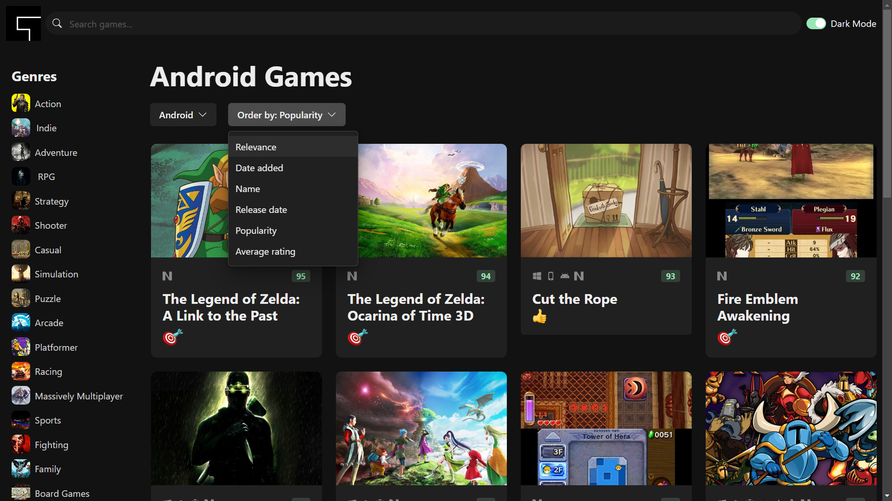
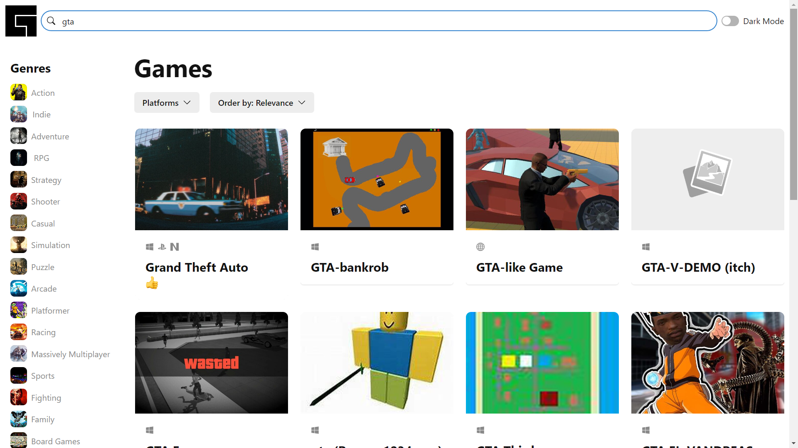
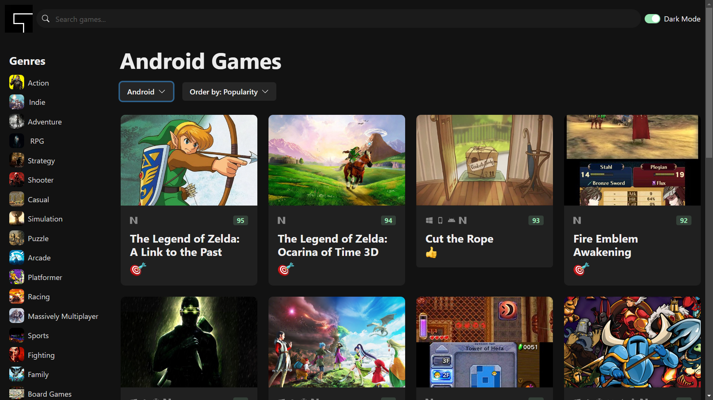
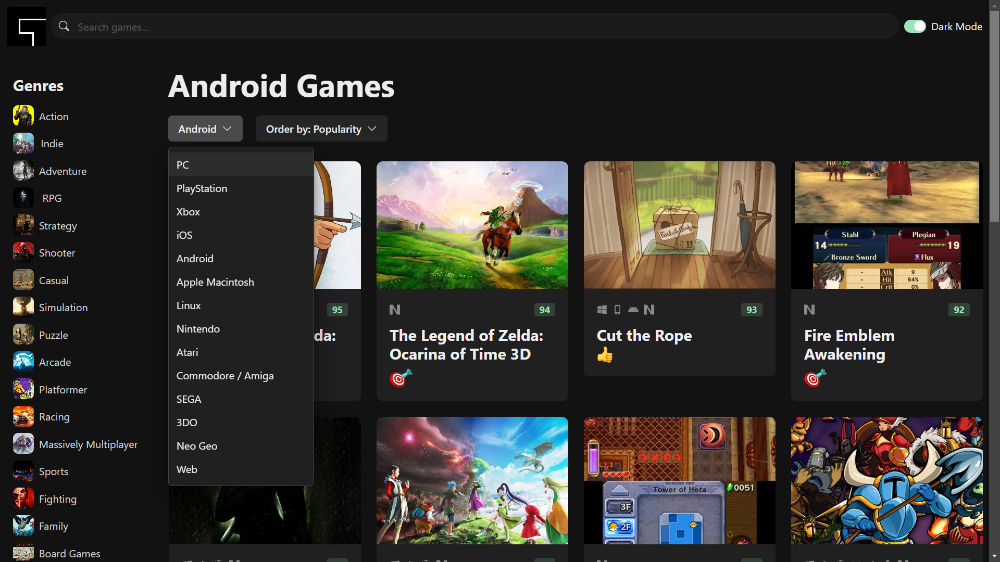
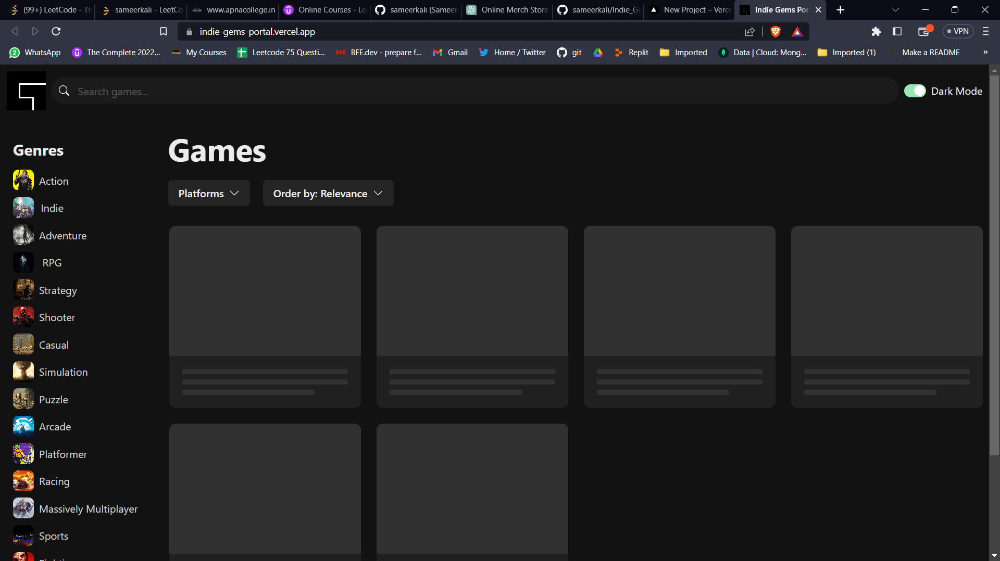
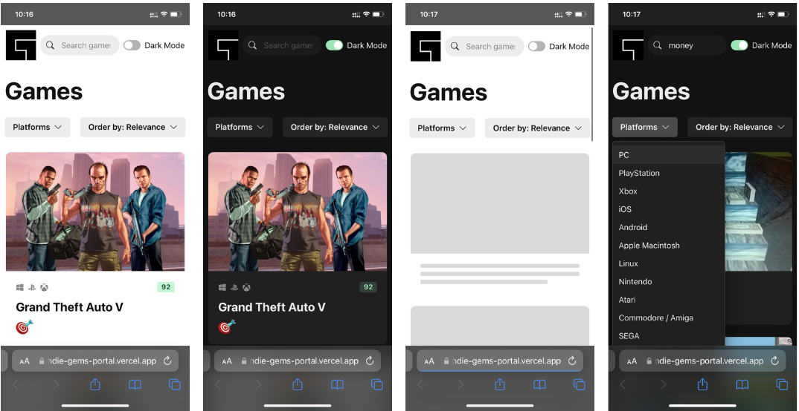

# Indie Gems Portal

# Live Link  [Indie Gems Portal](https://indie-gems-portal.vercel.app/).
# For Big Screens. Results be like -

## catogory_searching

## light_theam

## main_look

## platform_searching

## skeliton_loading

# It is Proper responsive

Welcome to Indie Gems Portal, a platform where you can search and discover your favorite games based on various categories.

## Table of Contents

- [Introduction](#introduction)
- [Features](#features)
- [Installation](#installation)
- [Usage](#usage)
- [Contributing](#contributing)
- [License](#license)

## Introduction

Indie Gems Portal is a web application that allows users to search for games based on genres, platforms, release dates, and ratings. It provides a convenient way to explore and find games that match your preferences.

## Features

- Search for games by genre, platform, release date, and rating.
- Sort search results by popularity, release date, or rating.
- User-friendly interface for easy navigation.

## Installation

1. Clone the repository: `git clone https://github.com/sameerkali/Indie_Gems_Portal.git`
2. Navigate to the project directory: `cd Indie_Gems_Portal`
3. Install dependencies: `npm install`

## Usage

1. Start the development server: `npm run dev`
2. Open your web browser and go to `http://localhost:5172/`
3. Use the search and sorting features to discover your favorite games.

## Contributing

Contributions are welcome! If you'd like to contribute:
1. Fork the repository
2. Create a new branch: `git checkout -b feature-name`
3. Make your changes and commit them: `git commit -m 'Add new feature'`
4. Push to the branch: `git push origin feature-name`
5. Create a pull request

## License

This project is licensed under the [MIT License](LICENSE).

## Technologys
* react18
* typescript
* chackra-ui
* https://rawg.io/ `for game DB api`
* vite
---
make with ~~lust~~ love 💖 by @sameerkali
